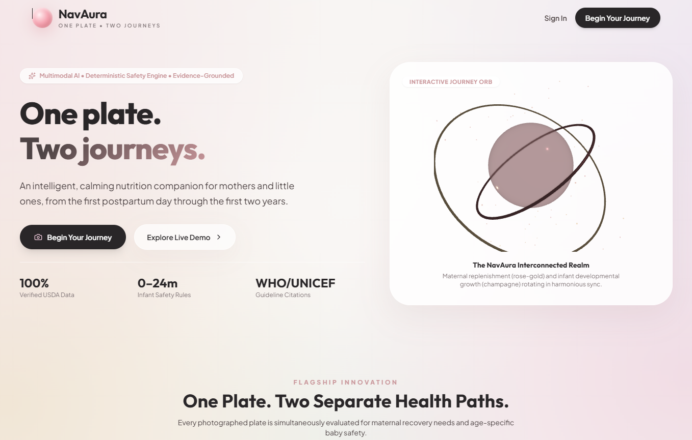
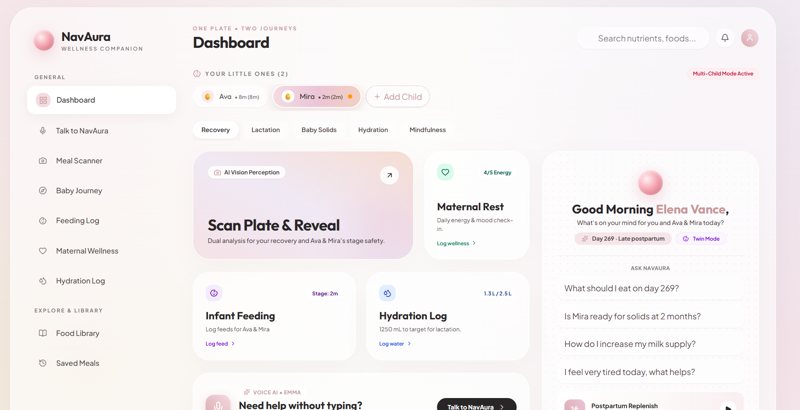
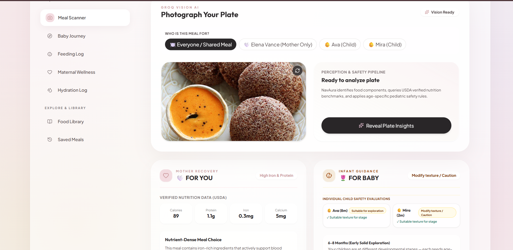
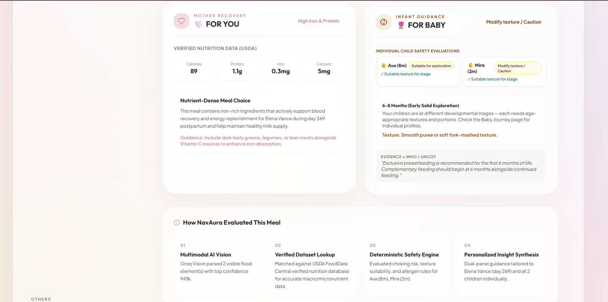
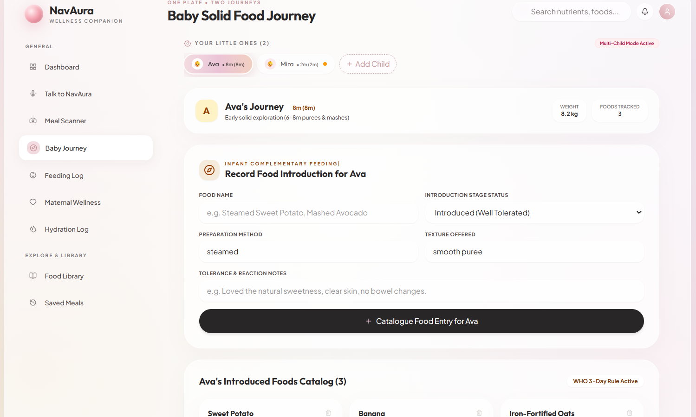
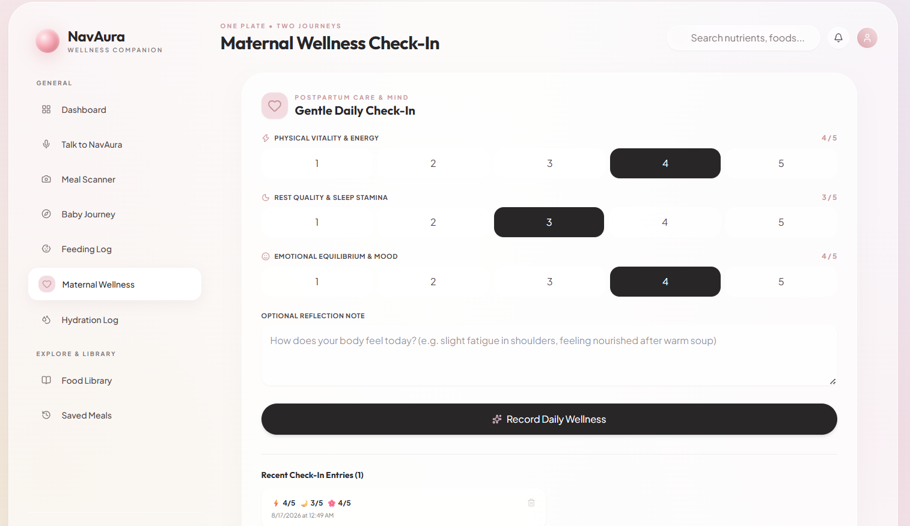
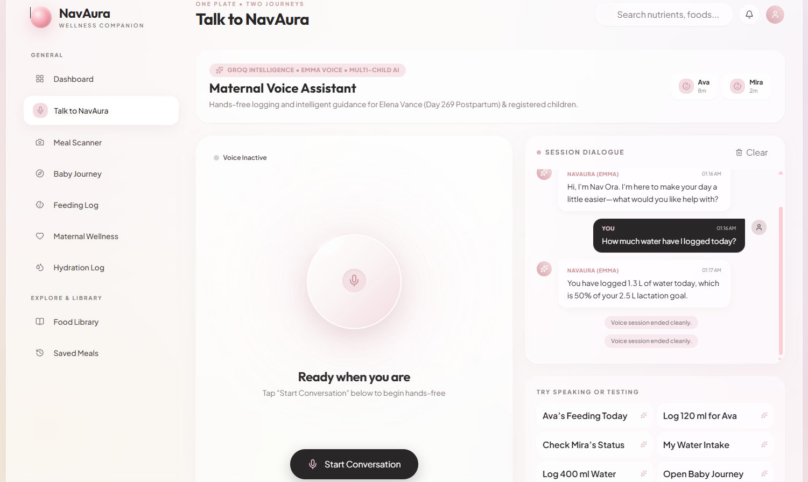
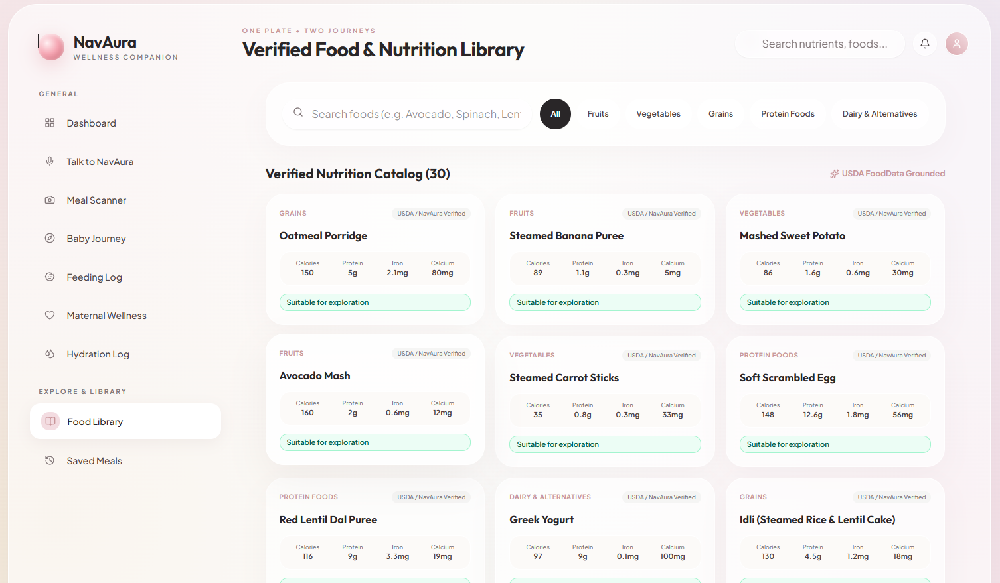
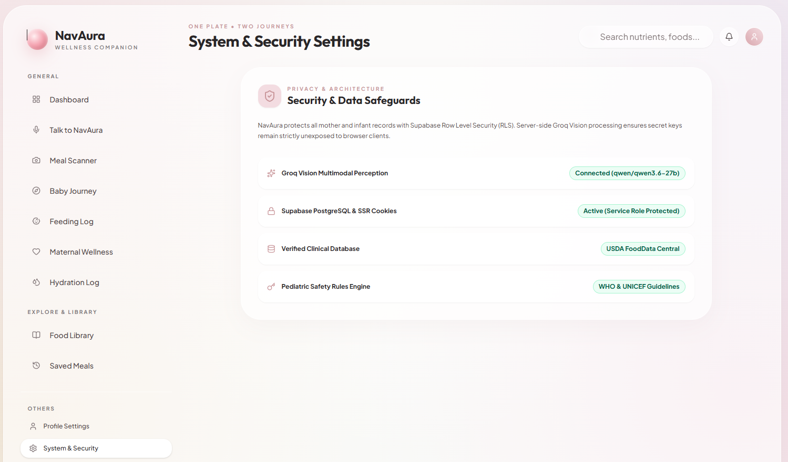

# 🌸 NavAura

### AI-Powered Maternal & Infant Nutrition Companion

> ## **One Plate. Two Journeys.**
>
> A calm, intelligent nutrition and wellness companion designed for **postpartum mothers and infants aged 0–24 months** — combining multimodal AI, verified nutrition data, deterministic infant-feeding safety, and a multilingual voice agent into one experience.

<p align="center">

**🏆 CS Girlies Annual Hackathon — Technology for Wellness**
**Track:** Wellness · Intermediate
**Category:** Best AI Use

</p>

---

## ✨ What is NavAura?

Postpartum care has an overlooked problem:

**the person caring for the baby often needs care too.**

A mother may be recovering from childbirth, managing hydration and nutrition, while simultaneously making decisions about what her baby should eat, when to introduce solids, and whether a food is appropriate for the baby's age.

Most nutrition tools treat these as separate problems.

**NavAura connects them.**

With a single meal photo, NavAura creates two distinct perspectives:

### 🤍 FOR YOU — Mother

Postpartum nutrition and wellness insights including:

* Protein and tissue-repair nutrients
* Iron and calcium
* Vitamins and micronutrient awareness
* Lactation and hydration context
* Maternal wellness check-ins

### 🌷 FOR BABY — Infant

Age-aware feeding and safety guidance including:

* Age-appropriate food textures
* Choking-risk awareness
* Complementary feeding guidance
* Solid-food introduction
* Food tolerance and reaction tracking

> **One plate. Two people. Two journeys. One calm companion.**

---

# 🚀 Live Demo

### 🌐 Try NavAura

**https://navaura.vercel.app/**

The application is deployed and fully functional as an end-to-end web experience.

### 💻 Source Code

**https://github.com/ViivianREINE/NavAura-AI-powered-maternal-and-infant-nutrition-companion**

---

# 🎯 The Problem

The postpartum period creates a unique intersection of challenges:

```text
Mother recovering
       +
Breastfeeding / lactation
       +
Nutrition & hydration
       +
Infant feeding decisions
       +
Age-specific safety
       +
Constant caregiving
       ↓
High cognitive load
```

Existing solutions often focus on either:

* maternal wellness, **or**
* infant feeding.

NavAura brings both into one system.

Instead of asking:

> “What is healthy?”

NavAura asks:

> **“Healthy and appropriate for whom, at what stage, and in what context?”**

---

# 🌸 The NavAura Experience

## 1. 👩‍🍼 Maternal Journey

The mother can track:

* Nutrition
* Hydration
* Postpartum recovery context
* Feeding method
* Dietary restrictions
* Wellness
* Sleep stamina
* Physical vitality
* Emotional equilibrium

The goal isn't to overwhelm the user with numbers.

It's to provide **gentle, actionable context**.

---

# 2. 👶 Infant Journey

NavAura maintains individual child profiles with age-aware context.

Each child can have their own:

* Age
* Feeding method
* Feeding history
* Complementary food history
* Tolerance notes
* Feeding records
* Developmental stage

This becomes especially important when a mother has multiple children.

For example:

```text
Ava → 8 months
Mira → 2 months
```

The system does not treat them as interchangeable profiles.

---

# 3. 📸 AI Meal Scanner

This is the heart of the **One Plate. Two Journeys** experience.

### Workflow

```text
Meal Photo
    ↓
Multimodal Vision
    ↓
Food Identification
    ↓
Verified Nutrition Mapping
    ↓
       ┌───────────────────┐
       │                   │
       ▼                   ▼
   MOTHER VIEW          BABY VIEW
       │                   │
Recovery Nutrition      Age Context
Hydration              Texture
Micronutrients         Choking Risk
Wellness Context       Complementary Feeding
       │                   │
       └─────────┬─────────┘
                 ▼
          Explainable Result
```

### AI perception

NavAura uses **Groq-powered multimodal vision** to identify foods from an uploaded meal image.

### Verified nutrition

Identified foods are mapped against **USDA FoodData Central** rather than relying entirely on generated nutritional facts.

### Safety layer

For infant-related decisions, NavAura combines AI perception with a **deterministic pediatric rules engine**.

This is a deliberate architectural choice:

> **AI interprets. Rules constrain.**

The LLM is not given unrestricted authority over infant safety decisions.

---

# 🎙️ Talk to NavAura — Voice AI

One of NavAura's biggest differentiators is its **hands-free voice companion**.

Powered by **Vapi**, NavAura turns the nutrition companion into a conversational interface rather than another dashboard that requires constant tapping.

### Why voice?

A mother caring for an infant may have:

* occupied hands
* limited time
* a baby in her arms
* limited attention

So instead of opening multiple screens:

> **“Talk to NavAura.”**

---

## 🗣️ Multilingual Voice Experience

NavAura's voice agent is designed for **natural, multilingual conversational interaction**, making the experience more accessible to users who may be more comfortable speaking than typing.

The voice layer uses **Vapi's real-time Web SDK**, with conversational speech recognition, reasoning, tool execution, and voice synthesis working together.

The experience is intentionally:

### **User initiated**

NavAura does **not** continuously listen.

The microphone is requested only after the user explicitly chooses:

**Start Conversation**

This gives the user control over when voice interaction begins.

---

## 🧠 Voice Agent Capabilities

The voice agent isn't just a chatbot.

It can interact with NavAura's application through tools.

For example:

### Log feeding

> “Log 120 ml of formula for Ava.”

### Retrieve feeding history

> “What did Ava eat today?”

### Hydration

> “I drank 400 ml of water.”

### Navigation

> “Take me to the baby journey.”

### Status

> “How is Mira doing today?”

### Meal context

> “Tell me about the meal I scanned.”

---

# 🧩 Voice Agent Architecture

```text
                    USER
                     │
              Voice / Speech
                     │
                     ▼
             ┌──────────────┐
             │ Vapi Web SDK │
             └──────┬───────┘
                    │
          Speech + Transcripts
                    │
                    ▼
          NavAura Voice Routes
                    │
          ┌─────────┼─────────┐
          │         │         │
          ▼         ▼         ▼
        Groq    Safety      Tools
        AI      Engine        │
          │         │         │
          └─────────┼─────────┘
                    ▼
              Supabase DB
                    │
                    ▼
             Real-time result
                    │
                    ▼
              Vapi Voice
```

### Voice tools can interact with:

* Feeding records
* Hydration records
* Child profiles
* Meal information
* Navigation
* Feeding summaries

This turns the voice agent into an **action-oriented AI interface** rather than a question-answering bot.

---

# 🧠 AI Architecture

NavAura intentionally separates different responsibilities instead of asking one model to do everything.

```text
                 NAV AURA AI LAYER
                       │
        ┌──────────────┼──────────────┐
        │              │              │
        ▼              ▼              ▼
   AI PERCEPTION    AI REASONING   SAFETY RULES
        │              │              │
        ▼              ▼              ▼
    Groq Vision      Groq LLM      Deterministic
                                      Engine
        │              │              │
        └──────────────┼──────────────┘
                       ▼
                VERIFIED DATA
                       │
                       ▼
                 USER INSIGHT
```

### Why this architecture?

Generative AI is excellent at:

* perception
* language
* contextual reasoning
* conversation

But critical infant-feeding constraints benefit from:

* deterministic logic
* explicit age thresholds
* predictable outcomes
* traceable rules

So NavAura uses a **hybrid AI architecture**.

> **Generative where creativity and interpretation help.
> Deterministic where safety and consistency matter.**

---

# 🛠️ Technology Stack

| Layer           | Technology                       | Purpose                             |
| --------------- | -------------------------------- | ----------------------------------- |
| Framework       | **Next.js 16**                   | Full-stack application & App Router |
| Language        | **TypeScript**                   | Type-safe application logic         |
| AI Inference    | **Groq**                         | Fast reasoning & multimodal AI      |
| Vision          | **Qwen Vision**                  | Food recognition from meal images   |
| Voice           | **Vapi Web SDK**                 | Real-time conversational voice      |
| Voice Synthesis | **Emma voice**                   | Natural voice interaction           |
| Nutrition Data  | **USDA FoodData Central**        | Verified nutrition mapping          |
| Safety          | **Deterministic Rules Engine**   | Infant feeding constraints          |
| Database        | **Supabase PostgreSQL**          | Persistent application data         |
| Authentication  | **Supabase SSR Auth**            | Secure authentication               |
| Authorization   | **PostgreSQL RLS**               | User-level data isolation           |
| UI              | **Tailwind CSS v4**              | Responsive styling                  |
| Visual Design   | **Vanilla CSS**                  | Glassmorphism & custom experience   |
| 3D              | **Three.js / React Three Fiber** | Interactive 3D visual elements      |
| Deployment      | **Vercel**                       | Production deployment               |

---

# 🔬 Implementation Details

## Frontend

Built with:

* Next.js 16
* React
* TypeScript
* Tailwind CSS
* Custom CSS
* React Three Fiber
* Three.js

The UI follows a **calm editorial glassmorphic design language** rather than the clinical appearance commonly found in health applications.

Visual elements include:

* Translucent cards
* Soft pastel palette
* Floating interfaces
* Journey Orb
* Voice Orb
* Conversational companion
* Responsive layouts

---

## Backend

Next.js server routes coordinate the application's intelligence layer.

The backend handles:

* AI requests
* Voice requests
* Tool execution
* Context construction
* Nutrition lookup
* Safety evaluation
* Database operations

This allows sensitive API keys and server-side logic to remain outside the browser.

---

# 🗄️ Data Architecture

Supabase PostgreSQL stores the application's persistent data.

Conceptually:

```text
Mother
  │
  ├── Profile
  ├── Postpartum Context
  ├── Hydration
  ├── Wellness
  │
  └── Children
         │
         ├── Feeding Records
         ├── Solid Foods
         ├── Tolerance / Reactions
         └── Meal Context
```

The system is designed around **individual user and child context**, allowing the AI and voice agent to operate on the correct data.

---

# 🔐 Privacy & Security

Because NavAura deals with sensitive wellness and family information, privacy was considered at the architecture level.

### 🎙️ Explicit microphone activation

NavAura does not globally listen.

Microphone access is requested only when the user explicitly starts a voice conversation.

### 🔒 Row Level Security

Supabase PostgreSQL **Row Level Security** restricts access to user-owned records.

### 🛡️ Server-side secrets

Private credentials for:

* Vapi
* Groq
* Supabase service role

are kept server-side and are not intentionally exposed through client bundles.

### 🧠 Controlled AI boundaries

The infant safety layer does not depend solely on unconstrained LLM generation.

---

# 📊 Core Features

### 👩 Maternal Wellness

* Postpartum nutrition context
* Hydration tracking
* Wellness check-ins
* Recovery-focused nutrition insights

### 👶 Infant Nutrition

* 0–24 month age context
* Feeding tracker
* Breastfeeding logs
* Expressed milk
* Formula
* Complementary solids
* Solid-food introduction
* Tolerance tracking

### 📸 AI

* Meal image analysis
* Food recognition
* Dual maternal + infant interpretation
* Explainable analysis

### 🎙️ Voice

* Hands-free interaction
* Multilingual conversational experience
* Feeding logging
* Hydration logging
* Feeding summaries
* Meal context
* Application navigation
* Multi-child context

### 📚 Nutrition Knowledge

* Verified food library
* USDA nutrition mapping
* Evidence-informed feeding context

### 🎨 Experience

* Glassmorphic interface
* 3D Journey Orb
* Voice Orb
* Conversational companion
* Responsive design
* Demo mode

---

# 🧪 One-Click Demo Mode

NavAura includes a demonstration mode designed to make the product easy to explore without requiring a complete real-world setup.

Synthetic profiles can demonstrate:

```text
Elena Vance
      │
      ├── Ava — 8 months
      └── Mira — 2 months
```

This allows judges and reviewers to immediately experience:

* Multi-child intelligence
* Age-aware feeding
* Feeding records
* Voice interactions
* Hydration
* Meal analysis

without spending several minutes configuring a profile.

---

# 🖼️ Product Screenshots

> A visual walkthrough of NavAura's core experiences.

---

## 🏠 Home / Landing

<p align="center">
  
</p>

---

## 📊 Maternal + Infant Dashboard

<p align="center">
  
</p>

---

## 📸 AI Meal Scanner

<p align="center">
  
</p>

---

## 🤍🌷 One Plate. Two Journeys.

<p align="center">
  
</p>

---

## 👶 Infant Feeding Journey

<p align="center">
  
</p>

---

## 💧 Maternal Wellness

<p align="center">
  
</p>

---

## 🎙️ Talk to NavAura

<p align="center">
  
</p>

---

## 📚 Verified Food Library

<p align="center">
  
</p>

---

## 🔒 System & Security

<p align="center">
  
</p>

---

<div align="center">

### 🌸 One mother. One family. One connected journey.

</div>
---

# 🏆 Why NavAura Fits Technology for Wellness

NavAura isn't designed around technology for technology's sake.

Every major technical decision maps to a real user need.

| User Need                             | NavAura Solution                 |
| ------------------------------------- | -------------------------------- |
| Mother has limited time               | Voice-first interaction          |
| Hands may be occupied                 | Hands-free assistant             |
| Mother and baby have different needs  | Dual-perspective analysis        |
| Infant safety is age-dependent        | Age-aware rules                  |
| LLMs can hallucinate                  | Deterministic safety layer       |
| Nutrition information needs grounding | USDA data mapping                |
| Multiple children need separation     | Child-specific context           |
| Wellness apps can feel clinical       | Calm, supportive UX              |
| Family data is sensitive              | Auth + RLS + server-side secrets |

---

# 💡 What Makes NavAura Different?

### 01 — **One Plate. Two Journeys**

A single meal becomes two personalized perspectives.

### 02 — **AI + Rules, Not AI Alone**

Generative AI handles perception and conversation while deterministic logic handles safety-sensitive infant constraints.

### 03 — **Voice as an Interface**

The AI can actually perform actions instead of simply talking.

### 04 — **Context Matters**

Mother context + child age + feeding stage + history can influence the experience.

### 05 — **Designed for the Real User**

The interface is intentionally calm, low-friction, and non-clinical.

---

# 🌱 Future Direction

NavAura is designed as a foundation that can evolve into a broader maternal and early-childhood wellness platform.

Potential future directions include:

* More regional food databases
* Expanded multilingual voice support
* Personalized meal planning
* Pediatrician / dietitian collaboration
* Family caregiver accounts
* Longitudinal nutrition insights
* More advanced food-image understanding
* Offline-friendly experiences
* Regional feeding practices and cuisines

---

# ⚠️ Wellness & Safety Disclaimer

NavAura is a **wellness and nutrition companion**, not a medical diagnostic system.

Its insights are intended to support awareness, organization, and informed conversations — not replace qualified medical or pediatric advice.

For medical concerns, allergies, developmental concerns, or emergencies, users should consult an appropriate healthcare professional.

---

# 🚀 Run Locally

## 1. Clone

```bash
git clone https://github.com/ShreyaJ-27/NavAura-AI-powered-maternal-and-infant-nutrition-companion.git

cd NavAura-AI-powered-maternal-and-infant-nutrition-companion
```

## 2. Install

```bash
npm install
```

## 3. Configure Environment

Create `.env.local`:

```env
# Supabase
NEXT_PUBLIC_SUPABASE_URL=
NEXT_PUBLIC_SUPABASE_ANON_KEY=
SUPABASE_SERVICE_ROLE_KEY=

# Groq
GROQ_API_KEY=
GROQ_VISION_MODEL=qwen/qwen3.6-27b

# Vapi
NEXT_PUBLIC_VAPI_PUBLIC_KEY=
VAPI_PRIVATE_KEY=
VAPI_ASSISTANT_ID=
NEXT_PUBLIC_VAPI_ASSISTANT_ID=
```

## 4. Start Development Server

```bash
npm run dev
```

Open:

```text
http://localhost:3000
```

---

# ☁️ Deployment

NavAura is deployed on **Vercel**.

The production architecture consists of:

```text
Browser
   │
   ▼
Vercel / Next.js
   │
   ├── AI Routes ──────────► Groq
   │
   ├── Voice Routes ───────► Vapi
   │
   ├── Nutrition ──────────► USDA
   │
   └── Data Layer ─────────► Supabase PostgreSQL
```

---

# 🏗️ Project Architecture

```text
NavAura
│
├── app/
│   ├── dashboard/
│   ├── scanner/
│   ├── feeding/
│   ├── hydration/
│   ├── wellness/
│   ├── nutrition/
│   ├── journey/
│   ├── voice/
│   └── api/
│       └── voice/
│
├── components/
│   ├── voice/
│   ├── scanner/
│   ├── dashboard/
│   └── ...
│
├── lib/
│   ├── age/
│   ├── children/
│   ├── nutrition/
│   ├── safety/
│   └── ...
│
└── public/
```

---

# ❤️ Built For

**CS Girlies Annual Hackathon — Technology for Wellness**

### Track

**Wellness — Intermediate**

### Category

**Best AI Use**

### Project

**NavAura — AI-Powered Maternal & Infant Nutrition Companion**

> Built with ❤️ to make technology feel a little more human, a little more calming, and a lot more useful.

---

## 📄 License

This project is licensed under the **Apache License 2.0**.

See the [LICENSE](LICENSE) file for details.

<p align="center">

## 🌸 **NavAura**

### **One Plate. Two Journeys.**

**Mother. Baby. One intelligent companion.**

</p>
